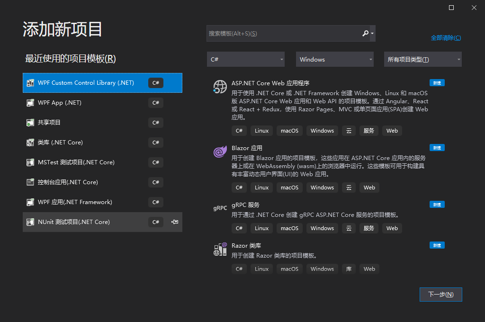
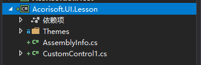
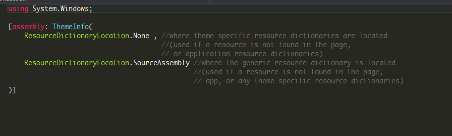

# 从零开始创建自定义控件【一】

这个课程是面向的是Wpf新手，那些想要学习如何自定义控件的同学。

## 第一步

打开Visual Studio，并且新建一个WPF Custom Control Library的项目。


这时候我们可以看到默认的自定义控件库项目包括以下几个元素：



* CustomControl1.cs
* Themes\Generic.xaml
* AssemblyInfo.cs

下面我来讲解一下这几个文件的主要意义。

### AssemblyInfo.cs

这个文件主要包含了生成程序集信息的特性，它里面的内容主要有：



```C#

using System.Windows;

[assembly: ThemeInfo(
    ResourceDictionaryLocation.None , //where theme specific resource dictionaries are located
                                      //(used if a resource is not found in the page,
                                      // or application resource dictionaries)
    ResourceDictionaryLocation.SourceAssembly //where the generic resource dictionary is located
                                              //(used if a resource is not found in the page,
                                              // app, or any theme specific resource dictionaries)
)]


```

我们再来看一下`Acorisoft.UI··` 中的AssemblyInfo.cs内容

``` C#
using System.Windows;
using System.Windows.Markup;

[assembly: ThemeInfo(ResourceDictionaryLocation.None , ResourceDictionaryLocation.SourceAssembly)]
[assembly: XmlnsDefinition("https://github.com/Acorisoft/UI" , "Acorisoft.UI.Buttons")]
[assembly: XmlnsDefinition("https://github.com/Acorisoft/UI" , "Acorisoft.UI.Controls")]
[assembly: XmlnsDefinition("https://github.com/Acorisoft/UI" , "Acorisoft.UI.Panels")]
[assembly: XmlnsDefinition("https://github.com/Acorisoft/UI" , "Acorisoft.UI.Windows")]

```

可以看到`Acorisoft.UI`的内容比自定义多出了一点。

`ThemeInfo` 用来指示样式外观的，这个特性暂且不解释，详细请看[深入WPF--Style](https://www.cnblogs.com/Zhouyongh/archive/2011/08/01/2123610.html)

`XmlnsDefinition` 用于将一个CLR命名空间映射到一个XML命名空间。


### CustomControl1.cs

在创建自定义控件项目的同时，系统也会帮你自动创建一个自定义控件，这个控件即CustomControl1。我们打开CustomControl1.cs即可看到里面的内容：

``` C#
using System;
using System.Collections.Generic;
using System.Linq;
using System.Text;
using System.Threading.Tasks;
using System.Windows;
using System.Windows.Controls;
using System.Windows.Data;
using System.Windows.Documents;
using System.Windows.Input;
using System.Windows.Media;
using System.Windows.Media.Imaging;
using System.Windows.Navigation;
using System.Windows.Shapes;

namespace Acorisoft.UI.Lesson
{
    /// <summary>
    /// Follow steps 1a or 1b and then 2 to use this custom control in a XAML file.
    ///
    /// Step 1a) Using this custom control in a XAML file that exists in the current project.
    /// Add this XmlNamespace attribute to the root element of the markup file where it is 
    /// to be used:
    ///
    ///     xmlns:MyNamespace="clr-namespace:Acorisoft.UI.Lesson"
    ///
    ///
    /// Step 1b) Using this custom control in a XAML file that exists in a different project.
    /// Add this XmlNamespace attribute to the root element of the markup file where it is 
    /// to be used:
    ///
    ///     xmlns:MyNamespace="clr-namespace:Acorisoft.UI.Lesson;assembly=Acorisoft.UI.Lesson"
    ///
    /// You will also need to add a project reference from the project where the XAML file lives
    /// to this project and Rebuild to avoid compilation errors:
    ///
    ///     Right click on the target project in the Solution Explorer and
    ///     "Add Reference"->"Projects"->[Select this project]
    ///
    ///
    /// Step 2)
    /// Go ahead and use your control in the XAML file.
    ///
    ///     <MyNamespace:CustomControl1/>
    ///
    /// </summary>
    public class CustomControl1 : Control
    {
        static CustomControl1()
        {
            DefaultStyleKeyProperty.OverrideMetadata(typeof(CustomControl1) , new FrameworkPropertyMetadata(typeof(CustomControl1)));
        }
    }
}


```
实际上我们把它精简一下,即得到以下内容:
``` C#
namespace $Namespace$
{
    public class CustomControl1 : Control
    {
        static CustomControl1()
        {
            DefaultStyleKeyProperty.OverrideMetadata(typeof(CustomControl1) , new FrameworkPropertyMetadata(typeof(CustomControl1)));
        }
    }
}

```

控件首先会添加一个静态构造函数，用于重写默认样式的元数据，重写元数据之后它会在themes/generic.xaml的文件获取默认的样式。

## Generic.xaml

`Generic.xaml` 用于放置自定义控件的默认样式，样式以Style元素定义，通过`TargetType`来指定该样式是哪个控件的默认样式。

``` XAML
<ResourceDictionary
    xmlns="http://schemas.microsoft.com/winfx/2006/xaml/presentation"
    xmlns:x="http://schemas.microsoft.com/winfx/2006/xaml"
    xmlns:local="clr-namespace:Acorisoft.UI.Lesson">
    <Style TargetType="{x:Type local:CustomControl1}">
        <Setter Property="Template">
            <Setter.Value>
                <ControlTemplate TargetType="{x:Type local:CustomControl1}">
                    <Border Background="{TemplateBinding Background}"
                            BorderBrush="{TemplateBinding BorderBrush}"
                            BorderThickness="{TemplateBinding BorderThickness}">
                    </Border>
                </ControlTemplate>
            </Setter.Value>
        </Setter>
    </Style>
</ResourceDictionary>

```
## 引用
* [深入WPF--Style](https://www.cnblogs.com/Zhouyongh/archive/2011/08/01/2123610.html)
* [WPF 依赖项属性的AddOwner与OverrideMetadata区别](https://huchengv5.github.io/post/WPF-%E4%BE%9D%E8%B5%96%E9%A1%B9%E5%B1%9E%E6%80%A7%E7%9A%84AddOwner%E4%B8%8EOverrideMetadata%E5%8C%BA%E5%88%AB.html)