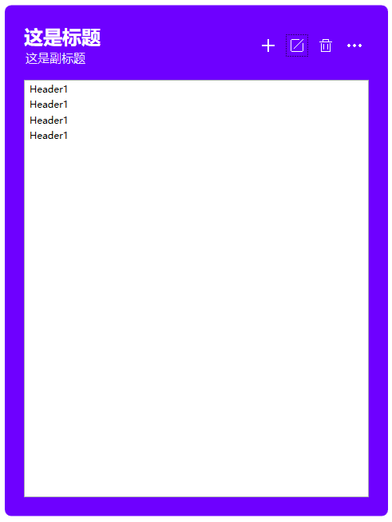

# `Acorisoft.UI`
`Acorisoft.UI` 类库用于为开发者提供更高层次的界面封装，与`MaterialDesignXamlInToolKit` 这些界面库不一样，`Acorisoft.UI`提供的是进一步封装的界面控件。我们在考虑带来更加丰富的UI控件的同时也在考虑设计我们自己的界面语言。

## `Acorisoft.UI` 的设计思路

我们不会提供大量的样式选择而是转而使用大量可定义细节的控件来实现丰富的样式。

### 减少附加属性的使用

目前的控件库，都是采用附加属性来实现丰富的外观和可定制效果，但是大量的附加属性在界面中实现属性值继承也会带来一些性能上的问题。

## 控件库

### 锚点面板

锚点面板在一定程度上用于替换 `HeaderedContentControl` 控件，它比`HeaderedContentControl` 控件更能表现功能层次的划分

### 工具面板（ToolbarPanel）

### 工具按钮（ToolbarButton）

工具按钮提供的是将按钮放置在工具栏区域的透明按钮控件。

### CTA 按钮（CTAButton）