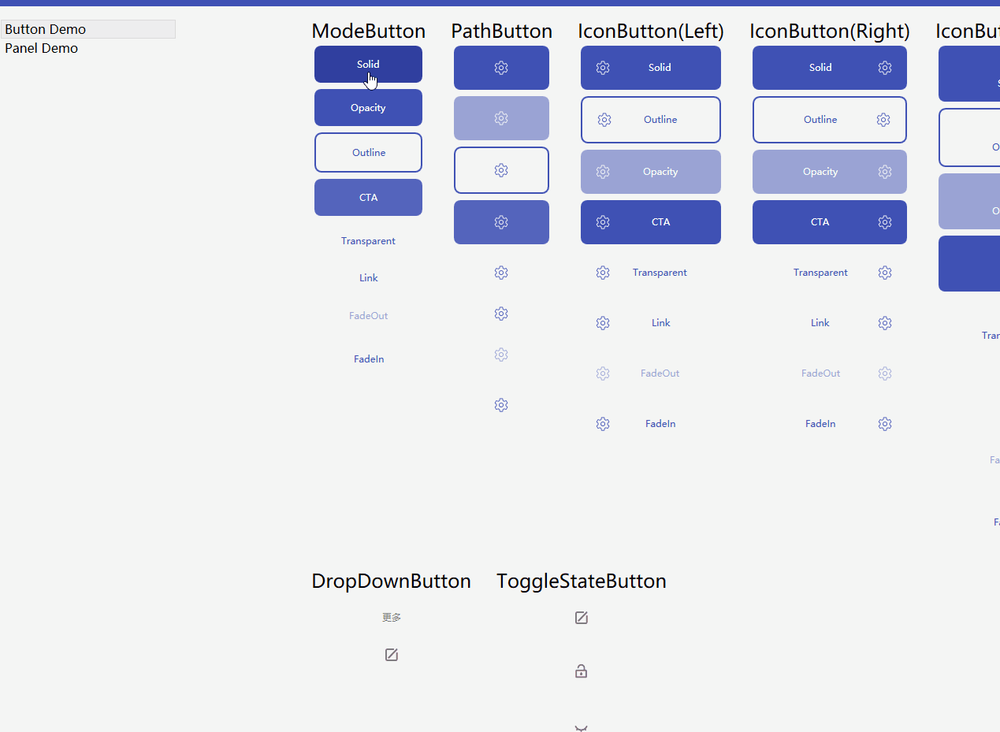

[English](Readme-en.md) [Chinese](README.md)

   

# `Acorisoft.UI`

`Acorisoft.UI` 类库旨在为开发者带来丰富的布局、组件，让您在开发的时候能够更方便、更快捷、更高效的创建界面，而非忍受大量重复的造轮子。这个项目的初衷不是为开发者带来丰富的样式，而是为用户提供独立不受第三方样式影响的组件和布局，您可以放心的混用不同第三方的界面库，例如`MaterialDesignInXamlToolKits`或者`MahApps`以及`HandyControl`。我们只是为这些类库提供一些拓展的组件和布局。

### 加入讨论

| | 西江月群 | 定风波群 | 广寒秋群 |
|-|:-:|:-:|:-:|
| 群号码 |  |  | 微信群 |
| 二维码 |  |  |  |

## 协作(Contribute)

目前这个类库不想支持`.NET Framework`，如果您有支持`FX`的需求，这边建议您Fork本项目，并自行创建项目解决方案引用本项目文件。本项目目前没有使用到`Task` `await` 等类型或者关键字，理论来说一次性编译成功的几率是100%。

### 环境

* VisualStudio 2019 16.8.2
* .NET 5 SDK 5.0.100

## 文档

我们在开发的同时也会将我们开发中运用到的一些知识整理成独立的文档。

* [从零开始创建自定义控件【一】](CustomControl_Lesson_1.md)
* [从零开始创建自定义控件【二】](CustomControl_Lesson_2.md)

## 赞助我们

## 加入项目的开发

本项目的开发异常简单，只需要将自己喜欢的布局复用，创建对应的Panel或者Layout即可。

#### 类型命名约定

Panel和Layout的命名规则如下：

>  来源位置+友好的命名+Panel(或者Layout)

例如：

这是一个推特消息样式，那么类型的命名应该为:

> TwitterMessagePanel

## 想要新的样式

如果您不想开发，但是又有喜欢的样式，我们这边建议您Fork该项目，并在Documentations的文件夹下加入您想要的布局效果图。

### 命名规则约定

如果您想要一个布局或者组件，那么请使用下列的命名方式提交到Thumbnails目录:

Desire_来源网站或者应用_给定一个友好命名_

## 控件库

### [按钮](Button.md)

在未来的版本中将会加入一些常用的按钮，这些按钮通过继承的形式实现，不会因为项目中添加了其他的样式类库而产生冲突，而这些按钮相较于`Button` 类型多了以下属性:

|类型         |  属性          | 属性类型    | 备注                 |
|:----------:|:--------------:| :--------:|:---------------------|
| ModeButton | Mode           | ButtonMode | 设置按钮模式，共有6种模式|
| PathButton | Icon           | Geometry   | 设置图标              |
| PathButton | IconWidth      | double     | 设置图标的宽度         |
| PathButton | IconHeight     | double     | 设置图标的高度         |
| PathButton | IconPadding    | Thickness  | 设置图标的内边距       |
| PathButton | IconThickness  | double     | 设置图标的边缘大小      |
| IconButton | Dock           | Dock       | 设置图标的停靠位置      |
| ImageButton| Image          | ImageSource| 设置图片               |

#### Roadmap
* 完成的
    * ModeButton 用于提供普通文本按钮样式支持
    * PathButton 用于提供路径按钮样式支持
    * IconButton 用于提供文本图标按钮样式支持
    * ImageButton
* 未完成的
    * FloatingButton 用于提供圆形浮空按钮样式支持

#### 为什么要加入按钮

因为我们不希望用户困扰，在许多时候混用不同风格的按钮会产生冲突，或者在使用第三方控件的时候发现给定的按钮样式还不能满足您的需求，因此我们抽象了三组按钮每个按钮都提供了六种相同的模式供您选择以备不同场景的使用。这三组按钮不会变更。

### 工具面板（ToolbarPanel）

### 呼吁面板(CalloutPanel)

### 警告面板(AlertPanel)

