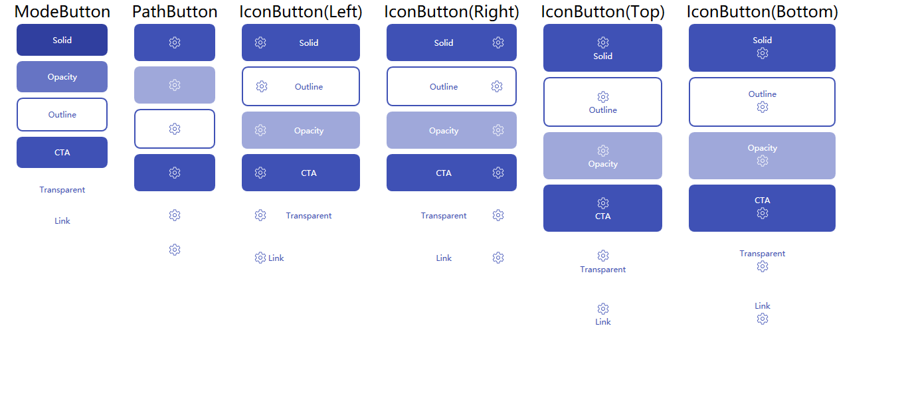
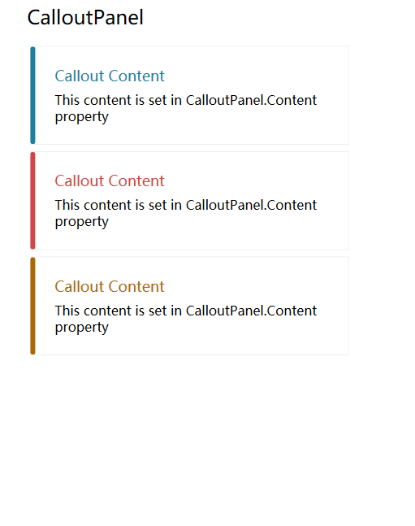
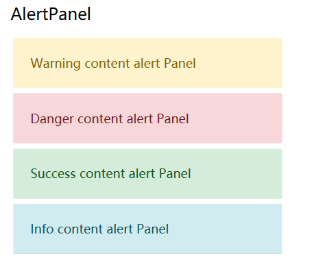

# Acorisoft.UI

## What was Acorisoft.UI

we decide to developing a ui library which contain rich widgets,templates,layout or control rather than ui themes,that you can use it to any ui theme such as `MaterialDesignInXamlToolKits` or `MahApps` or `HandyControl` etc.

## How to use it

just copy it to `App.xaml`

``` XAML

<ResourceDictionary>
    <ResourceDictionary.MergedDictionaries>
        <ResourceDictionary Source="pack://application:,,,/Acorisoft.UI;component/Themes/Generic.xaml"/>
    </ResourceDictionary.MergedDictionaries>
</ResourceDictionary>
```

## How to contribute

if you findsome templates or widget which you want it,you can push the widget image to `Documentations` folder


## Notice
this library work for `.NET 5`,and we not decide to support `.net framework`.

## ControlGallery

### Button



在未来的版本中将会加入一些常用的按钮，这些按钮通过继承的形式实现，不会因为项目中添加了其他的样式类库而产生冲突，而这些按钮相较于`Button` 类型多了以下属性:

|类型         |  属性          | 属性类型    | 备注                 |
|:----------:|:--------------:| :--------:|:---------------------|
| ModeButton | Mode           | ButtonMode| 设置按钮模式，共有6种模式|
| PathButton | Icon           | Geometry  | 设置图标              |
| PathButton | IconWidth      | double    | 设置图标的宽度         |
| PathButton | IconHeight     | double    | 设置图标的高度         |
| PathButton | IconPadding    | Thickness | 设置图标的内边距       |
| PathButton | IconThickness  | double    | 设置图标的边缘大小      |
| IconButton | Dock           | Dock      | 设置图标的停靠位置      |

#### Roadmap

* <del>ModeButton</del> 用于提供普通文本按钮样式支持
* <del>PathButton</del> 用于提供路径按钮样式支持
* <del>IconButton</del> 用于提供文本图标按钮样式支持
* FloatingButton 用于提供圆形浮空按钮样式支持

### ToolbarPanel


### CalloutPanel



### AlertPanel

