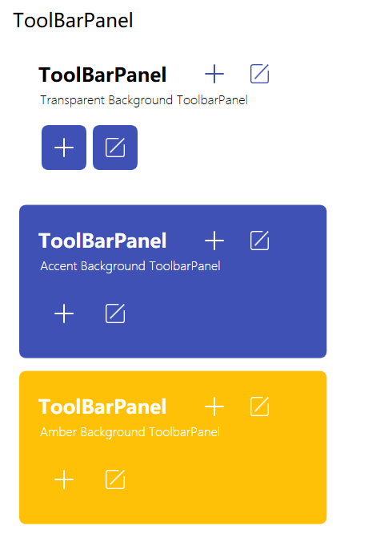
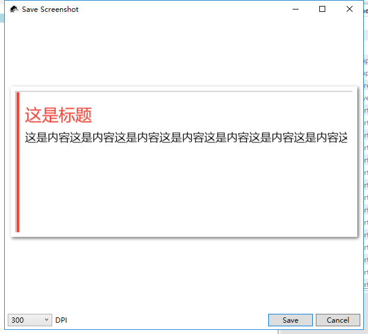

# Acorisoft.UI

## What was Acorisoft.UI

we decide to developing a ui library which contain rich widgets,templates,layout or control rather than ui themes,that you can use it to any ui theme such as `MaterialDesignInXamlToolKits` or `MahApps` or `HandyControl` etc.

## How to use it

just copy it to `App.xaml`

``` XAML

<ResourceDictionary>
    <ResourceDictionary.MergedDictionaries>
        <ResourceDictionary Source="pack://application:,,,/Acorisoft.UI;component/Themes/Generic.xaml"/>
    </ResourceDictionary.MergedDictionaries>
</ResourceDictionary>
```

## How to contribute

if you findsome templates or widget which you want it,you can push the widget image to `Documentations` folder


## Notice
this library work for `.NET 5`,and we not decide to support `.net framework`.

## ControlGallery

### PathButton


### ToolbarPanel


### ContextualPanel

